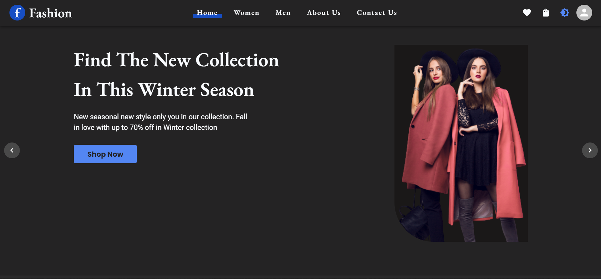

# Fashion-App  [Live Demo](https://fashion-store-umber.vercel.app/)

## Description

Welcome to our project! This is a Fashion App made in Javascript and React.js framework. It allows users to quickly and easily browse, search for, and purchase clothing and accessories. The app features a user-friendly interface, a wide selection of products, and a secure checkout process.

## Technologies

- HTML
- CSS
- JavaScript
- React
- Redux Toolkit
- Material UI
- React-Spring
- Email.js
- JSON-Server

## Features

- Authorization and Authentication
- Product pagination
- Product search feature
- Product Filter feature
- Product Details and select colors and sizes
- User profile with orders
- Full-featured shopping cart and wishlist
- Checkout process (shipping, payment method, etc)
- light and dark mode

## How to run the app locally?

To run the app locally,

- First fork and clone the repository.
- Then change to the directory where the repository is cloned.
- Run `npm install` to install the dependencies.
- Run `npm start` to run the application.
- Run `npm run json-server` to run the json server.
